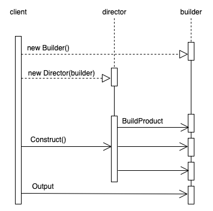

- [设计模式](#设计模式)
- [Code Practise](#code-practise)
- [Brief](#brief)
	- [Design pattern space](#design-pattern-space)
	- [Pattern Relation](#pattern-relation)
	- [Design Pattern In MVC architect](#design-pattern-in-mvc-architect)
- [Cretional Patterns](#cretional-patterns)
	- [Abstract Factory](#abstract-factory)
		- [Indent](#indent)
		- [Motivation](#motivation)
		- [Uml](#uml)
		- [Show Me The Code](#show-me-the-code)
		- [Consequences](#consequences)
			- [Isolates concrete classes](#isolates-concrete-classes)
			- [It makes exchanging product families easy](#it-makes-exchanging-product-families-easy)
			- [It promotes consistency among products.](#it-promotes-consistency-among-products)
			- [Supporting new kinds of products is difficult.](#supporting-new-kinds-of-products-is-difficult)
		- [Implementation](#implementation)
			- [Factories as singletons.](#factories-as-singletons)
			- [Creating the products](#creating-the-products)
			- [Defining extensible factories](#defining-extensible-factories)
	- [Factory Method](#factory-method)
		- [Indent](#indent-1)
	- [Builder](#builder)
		- [Indent](#indent-2)
		- [Motivation](#motivation-1)
		- [UML](#uml-1)
		- [Show Me The Code](#show-me-the-code-1)
		- [Consequences](#consequences-1)
		- [Implementation](#implementation-1)
	- [Prototype](#prototype)
		- [Indent](#indent-3)
		- [Motivation](#motivation-2)
		- [UML](#uml-2)
		- [Show Me The Code](#show-me-the-code-2)
		- [Consequences](#consequences-2)
		- [Implementation](#implementation-2)
	- [Singleton](#singleton)
		- [Indent](#indent-4)
		- [Motivation](#motivation-3)
		- [UML](#uml-3)
		- [Show Me The Code](#show-me-the-code-3)
		- [Consequences](#consequences-3)
		- [Implementation](#implementation-3)
- [Structural Patterns](#structural-patterns)
	- [Adapter](#adapter)
		- [Indent](#indent-5)
		- [Motivation](#motivation-4)
		- [UML](#uml-4)
		- [Show Me The Code](#show-me-the-code-4)
		- [Consequences](#consequences-4)
		- [Implementation](#implementation-4)
	- [Bridge](#bridge)
		- [Indent](#indent-6)
		- [Motivation](#motivation-5)
		- [UML](#uml-5)
		- [Show Me The Code](#show-me-the-code-5)
		- [Consequences](#consequences-5)
		- [Implementation](#implementation-5)
	- [Composite](#composite)
		- [Indent](#indent-7)
		- [Motivation](#motivation-6)
		- [UML](#uml-6)
		- [Show Me The Code](#show-me-the-code-6)
		- [Consequences](#consequences-6)
		- [Implementation](#implementation-6)
	- [Decorator](#decorator)
		- [Indent](#indent-8)
		- [Motivation](#motivation-7)
		- [UML](#uml-7)
		- [Show Me The Code](#show-me-the-code-7)
		- [Consequences](#consequences-7)
		- [Implementation](#implementation-7)
	- [Facade](#facade)
		- [Indent](#indent-9)
		- [Motivation](#motivation-8)
		- [UML](#uml-8)
		- [Show Me The Code](#show-me-the-code-8)
		- [Consequences](#consequences-8)
		- [Implementation](#implementation-8)
	- [Flyweight](#flyweight)
		- [Indent](#indent-10)
		- [Motivation](#motivation-9)
		- [UML](#uml-9)
		- [Show Me The Code](#show-me-the-code-9)
		- [Consequences](#consequences-9)
		- [Implementation](#implementation-9)
	- [Proxy](#proxy)
		- [Indent](#indent-11)
		- [Motivation](#motivation-10)
		- [UML](#uml-10)
		- [Show Me The Code](#show-me-the-code-10)
		- [Consequences](#consequences-10)
		- [Implementation](#implementation-10)
- [Behavioral Patterns](#behavioral-patterns)
	- [Chain of Reponsibility](#chain-of-reponsibility)
		- [Indent](#indent-12)
	- [Command](#command)
		- [Indent](#indent-13)
		- [Motivation](#motivation-11)
		- [UML](#uml-11)
		- [Show Me The Code](#show-me-the-code-11)
		- [Consequences](#consequences-11)
		- [Implementation](#implementation-11)
	- [Interpreter](#interpreter)
		- [Indent](#indent-14)
		- [Motivation](#motivation-12)
		- [UML](#uml-12)
		- [Show Me The Code](#show-me-the-code-12)
		- [Consequences](#consequences-12)
		- [Implementation](#implementation-12)
	- [Iterator](#iterator)
		- [Indent](#indent-15)
		- [Motivation](#motivation-13)
		- [UML](#uml-13)
		- [Show Me The Code](#show-me-the-code-13)
		- [Consequences](#consequences-13)
		- [Implementation](#implementation-13)
	- [Mediator](#mediator)
		- [Indent](#indent-16)
		- [Motivation](#motivation-14)
		- [UML](#uml-14)
		- [Show Me The Code](#show-me-the-code-14)
		- [Consequences](#consequences-14)
		- [Implementation](#implementation-14)
	- [Memento](#memento)
		- [Indent](#indent-17)
		- [Motivation](#motivation-15)
		- [UML](#uml-15)
		- [Show Me The Code](#show-me-the-code-15)
		- [Consequences](#consequences-15)
		- [Implementation](#implementation-15)
	- [Observer](#observer)
		- [Indent](#indent-18)
		- [Motivation](#motivation-16)
		- [UML](#uml-16)
		- [Show Me The Code](#show-me-the-code-16)
		- [Consequences](#consequences-16)
		- [Implementation](#implementation-16)
	- [State](#state)
		- [Indent](#indent-19)
		- [Motivation](#motivation-17)
		- [UML](#uml-17)
		- [Show Me The Code](#show-me-the-code-17)
		- [Consequences](#consequences-17)
		- [Implementation](#implementation-17)
	- [Strategy](#strategy)
		- [Indent](#indent-20)
		- [Motivation](#motivation-18)
		- [UML](#uml-18)
		- [Show Me The Code](#show-me-the-code-18)
		- [Consequences](#consequences-18)
		- [Implementation](#implementation-18)
	- [Template Method](#template-method)
		- [Indent](#indent-21)
		- [Motivation](#motivation-19)
		- [UML](#uml-19)
		- [Show Me The Code](#show-me-the-code-19)
		- [Consequences](#consequences-19)
		- [Implementation](#implementation-19)
	- [Visitor](#visitor)
		- [Indent](#indent-22)
		- [Motivation](#motivation-20)
		- [UML](#uml-20)
		- [Show Me The Code](#show-me-the-code-20)
		- [Consequences](#consequences-20)
		- [Implementation](#implementation-20)

# 设计模式

这是一个由浅入深的过程, 教材参考

+ [Design Patterns_Elements of Reusable Object-Oriented Software ](Design%20Patterns_Elements%20of%20Reusable%20Object-Oriented%20Software%20.pdf)

+ [design patterns best practices in java](design-patterns-and-best-practices-in-java.pdf)

或者可以参考中文版

+ [设计模式：可复用面向对象软件的基础](设计模式：可复用面向对象软件的基础.pdf)

+ [java 设计模式及实践](Java设计模式及实践.pdf)

+ https://refactoringguru.cn/design-patterns

+ https://tech.meituan.com/2022/03/10/interesting-talk-about-design-patterns.html

之后参考进行深入学习

+ [Design Patterns Implement By Java](  https://java-design-patterns.com/patterns/)

> 注意: 千万注意: 菜鸟教程的设计模式教程很多是错误的 ! 千万不要图方便去学这个教程 (例如抽象工厂就是完全错误的)  
> 当然个人不建议用菜鸟教程任何一个课程
# Code Practise

+ [Java - ongoing](Java)
+ [Go - ongoing](Go)
+ [Rust - ongoing](Rust)
+ [C - ongoing](C)
+ [React - ongoing](React)
+ [Node - ongoing](Nodejs)

# Brief

## Design pattern space


## Pattern Relation


## Design Pattern In MVC architect

The View-Controller relationship is an example of the Strategy (315) design pattern. A Strategy is an object that represents an algorithm. It’s useful when you want to replace the algorithm either statically or dynamically, when you have a lot of variants of the algorithm, or when the algorithm has complex data structures that you want to encapsulate.


MVC uses other design patterns, such as Factory Method (107) to specify the default controller class for a view and Decorator (175) to add scrolling to a view. But the main relationships in MVC are given by the Observer, Composite, and Strategy design patterns

# Cretional Patterns

Creational design patterns abstract the instantiation process. They help make a system independent of how its objects are created, composed, and represented.


<u>A class creational pattern uses inheritance to vary the class that’s instantiated</u>, whereas an object creational pattern will delegate instantiation to another object.


Emphasis creational patterns shifts away from hard-coding a fixed set of behaviors toward defining a smaller set of fundamental behaviors that can be composed into any number of more complex ones. Thus creating objects with particular behaviors requires more than simply instantiating a class.


There are some recurring themes in these patterns.

+ First, they all encapsulate knowledge about which concrete classes the system uses.
+ Second, they hide how instances of these classes are created and put together.
+ All the system at large knows about the objects is their interfaces as defined by abstract classes.

Consequently, the creational patterns give you a lot of flexibility in what gets
created, who creates it, how it gets created, and when. They let you configure a
system with “product” objects that vary widely in structure and functionality.
Configuration can be static (that is, specified at compile-time) or dynamic (at
run-time).


The creational patterns are closely related. For example, there are cases when either Prototype or Abstract Factory could be used profitably. At other times they are complementary: Builder can use one of the other patterns to implement which components get built. Prototype can use Singleton in its implementation

## Abstract Factory

### Indent  

Provide an interface for creating families of related or dependent objects without specifying their concrete classes.


If the system output needs to interact with many products of different kinds, for the reason that the architect may not get the comprehensive information in advance or may consider of the scalability of system, the architect do not want to construct system based on the specific class. In this situation, you can use Abstract Factory Disign Pattern to build system.

### Motivation

Consider a user interface toolkit that supports multiple look-and-feel standards, such as `StandardA` and `StandardB`. Different look-and-feels define different appearances and behaviors for user interface “output” like scroll `Window`, `Scroll`, and `Button`.


To be portable across look-and-feel standards, an application should not hard-code its output for a particular look and feel.


We can solve this problem by defining an `AbstractFactory` class that declares an interface for creating each basic kind of output and concretes subclasses implement output for specific look-and-feel standards(`StandardA` and `StandardB`). 

### Uml


### Show Me The Code
[abstract_function](./code/Java/src/main/java/creational_pattern/abstract_function)


### Consequences

Abstract Factory pattern has the following benefits and liabilities:

#### Isolates concrete classes

The Abstract Factory pattern helps you control the classes of objects that an application creates. Because a factory encapsulates the responsibility and the process of creating product objects, it isolates clients from implementation classes. 

+ Clients manipulate instances through their abstract interfaces.
+ Product class names are isolated in the implementation of the concrete factory
+ They do not appear in client code

####  It makes exchanging product families easy

The class of a concrete factory appears only once in an application—that is, where it’s instantiated. This makes it easy to change the concrete factory an application uses. 

+ It can use different product configurations simply by changing the concrete factory. 
+ Because an abstract factory creates a complete family of products, the whole product family changes at once. 

#### It promotes consistency among products.

When product objects in a family are designed to work together, it’s important that an application use objects from only one family at a time. AbstractFactory makes this easy to enforce.

#### Supporting new kinds of products is difficult.

Supporting new kinds of products requires extending the factory interface, which involves changing the AbstractFactory class and all of its subclasses. We discuss one solution to this problem in the Implementation section.

### Implementation  

Here are some useful techniques for implementing the Abstract Factory pattern.

#### Factories as singletons.

An application typically needs only one instance of a ConcreteFactory per product family. So it’s usually best implemented as a `Singleton Method` .

#### Creating the products

AbstractFactory only declares an interface for creating products. 

+ The most common way to implement a subclass is to define a factory method (see `Factory Method` ) for each product. Factory will specify its products by overriding the factory method for each. While this implementation is simple, it requires a new concrete factory subclass for each product family.
+ If many product families are possible, the concrete factory can be implemented using the `Prototype Pattern`. The concrete factory is initialized with a prototypical instance of each product in the family, and it creates a new product by cloning its prototype. 

#### Defining extensible factories

Adding a new kind of product requires changing the AbstractFactory interface and all the classes that depend on it.


A more flexible but less safe design is to add a parameter to operations that create objects ( `Polymorphism`) - This parameter specifies the kind of object to be created, which could be a class identifier, an integer, a string, or anything else that identifies the kind of product.


For example, AbstractFactory only needs a single “Make” operation with a parameter indicating the kind of object to create. This is the technique used in the Prototype-and the class-based abstract factories discussed earlier.

## Factory Method


### Simple factory & Static factory pattern

The factory method pattern is an improvement upon the `Static Factory Pattern`. Before start, let's talk about these patterns.

#### Simple factory pattern

A simple factory pattern as showed below

```java
Vehicle vehicle = new Car();
Vehicle vehicle = new Truck();
```

Static factory pattern

A static factory pattern as showed below

```java
public class VehicleFactory
{
  public enum VehicleType
  {
    Bike,Car,Truck
  }
  public static Vehicle create(VehicleType type)
  {
    if (type.equals(VehicleType.Bike))
    return new Bike();
    if (type.equals(VehicleType.Car))
    return new Car();
    if (type.equals(VehicleType.Truck))
    return new Truck();
    else return null;
  }
}
```

### Indent

Define an interface for creating an object, but let subclasses decide which class to instantiate. Factory Method lets a class defer instantiation to subclasses.

### Motivation

Inheritance is one of the fundamental concepts in object-oriented programming. Along with subtyping polymorphism, it gives us the is/a relationship.


Consider a framework for applications that can present multiple documents to the user. Two key abstractions in this framework are the classes **Car** and **Creator**. Both classes are abstract, and clients have to subclass them to realize their application-specific implementations. Because the particular Car subclass to instantiate is application-specific, the Application class can’t predict the subclass of Car to instantiate—the Creator class only knows when a new Car should be created, not what kind of Car to create. This creates a dilemma: The framework must instantiate classes, but it only knows about abstract classes, which it cannot instantiate.


The `Factory Method pattern` offers a solution. It encapsulates the knowledge of which Car subclass to create and moves this knowledge out of the framework.


To create a drawing application, for example, we define the classes **CarCreator** and **Car**. The CarCreator class is responsible for managing Car and will create them .


CarCreator subclasses redefine an abstract createCar() operation on CarCreator to return the appropriate Car subclass. Once an CarCreator subclass is instantiated, it can then instantiate application-specific Car without knowing their class. We call createCar() a factory method because it’s responsible for “manufacturing” an object.

### UML


### Show Me The Code

[Factory Method](./code/Java/src/main/java/creational_pattern/factory_method)


### Consequences

Here are two additional consequences of the Factory Method pattern:

+ Provides hooks for subclasses. Creating objects inside a class with a factory method is always more flexible than creating an object directly. Factory Method gives subclasses a hook for providing an extended version of an object. In this case the factory method is not abstract but provides a reasonable default implementation.
+ Connects parallel class hierarchies. 

### Implementation

Consider the following issues when applying the Factory Method pattern:

1. Two major varieties: 
   + the case when the Creator class is an abstract class and does not provide an implementation for the factory method it declares. It requires subclasses to define an implementation, because there’s no reasonable default. It gets around the dilemma of having to instantiate unforeseeable classes.
   + the case when the Creator is a concrete class and provides a default implementation for the factory method. The concrete Creator uses the factory method primarily for flexibility. 
2. `Parameterized factory methods`. Another variation on the pattern lets the factory method create multiple kinds of products. The factory method takes a parameter that identifies the kind of object to create. All objects the factory method creates will share the Product interface. Overriding a parameterized factory method lets you easily and selectively extend or change the products that a Creator produces. You can introduce new identifiers for new kinds of products, or you can associate existing identifiers with different products.
3. Language-specific variants and issues. Different languages lend themselves to other interesting variations and caveats. You can avoid this by being careful to access products solely through accessor operations that create the product on demand. Instead of creating the concrete product in the constructor, the constructor merely initializes it to 0. The accessor returns the product. But first it checks to make sure the product exists, and if it doesn’t, the accessor creates it. This technique is sometimes called `lazy initialization`.
4. Using `templates` to avoid subclassing. As we’ve mentioned, another potential problem with factory methods is that they might force you to subclass just to create the appropriate Product objects.
5. `Naming conventions`. It’s good practice to use naming conventions that make it clear you’re using factory methods.


## Builder

### Indent

Separate the construction of a complex object from its representation so that the same construction process can create different representations.


### Motivation

The builder pattern serves the same purpose as the other creational patterns, but it does so in a different way and for different reasons. When developing complex applications, the code tends to become more complex. Classes tend to **encapsulate** more functionality and, at the same time, class structures become more **complex**. As the functionality grows, more scenarios need to be covered and, for these, different representations of classes are required.


When we have a complex class that we need to instantiate to different objects with different structures or different internal states, we can use separate classes to encapsulate the instantiation logic. These classes are called `builders`. Each time we need objects from the same class with a different structure, we can create another builder to create such instances.


<u>The same concept can be used not only for classes for which we need different representations but also for complex objects composed of other objects.</u>


Creating builder classes to encapsulate the logic to instantiate complex objects is consistent with the `single responsibility principle` and with the `open/closed principle`. When we need objects with different structures, we can add new builder classes, so the code is closed for modification and open for extension, as shown in the diagram:

### UML

+ Class Diagram


+ Interaction Diagram




### Show Me The Code

[builder](./code/Java/src/main/java/creational_pattern/builder)

### Consequences

#### It lets you vary a product’s internal representation

+ The Builder object provides the director with an abstract interface for constructing the product. The interface lets the builder hide the representation and internal structure of the product.
+ It also hides how the product gets assembled. Because the product is constructed through an abstract interface, all you have to do to change the product’s internal representation is define a new kind of builder.

#### It isolates code for construction and representation

+ The Builder pattern improves modularity by encapsulating the way a complex object is constructed and represented. Clients needn’t know anything about the classes that define the product’s internal structure.

+ Each Builder contains all the code to create and assemble a particular kind of product. The code is written once; then different Directors can reuse it to build Product variants from the same set of parts.

#### It gives you finer control over the construction process

+ Unlike creational patterns that construct products in one shot, the Builder pattern constructs the product step by step under the director’s control. Only when the product is finished does the director retrieve it from the builder.
+ Hence the Builder interface reflects the process of constructing the product more than other creational patterns.This gives you finer control over the construction process and consequently the internal structure of the resulting product.

### Implementation

Typically there’s an abstract `Builder` class that defines an operation for each component that a director may ask it to create. The operations do nothing by default. A `ConcreteBuilder` class overrides operations for components it’s interested in creating.

Here are other implementation issues to consider:

+ Assembly and construction `interface`.

  + The Builder class interface must be general enough to allow the construction of products for all kinds of concrete builders.

  + A model where the results of construction requests are simply appended to the product is usually sufficient. 
  + But sometimes you might need access to parts of the product constructed earlier. In some cases, the builder would return child nodes to the director, which then would pass them back to the builder to build the parent nodes.

+ Why no abstract class for products? 

  In the common case, the products produced by the concrete builders differ so greatly in their representation that there is little to gain from giving different products a common parent class. 


## Prototype

### Indent
Specify the kinds of objects to create using a prototypical instance, and create new objects by copying this prototype.


### Motivation

You could build an editor for music scores by customizing a general framework for graphical editors and adding new objects that represent notes, rests, and staves. 

	+ The editor framework may have a palette of tools for adding these music objects to the score. The palette would also include tools for selecting, moving, and otherwise manipulating music objects. U
	+ sers will click on the quarter-note tool and use it to add quarter notes to the score. 
	+ Or they can use the move tool to move a note up or down on the staff, thereby changing its pitch.


Let’s assume the framework provides an abstract Graphic class for graphical components, like notes and staves. Moreover, it’ll provide an abstract Tool class for defining tools like those in the palette. The framework also predefines a GraphicTool subclass for tools that create instances of graphical objects and add them to the document.


But GraphicTool presents a problem to the framework designer - The classes for notes and staves are specific to our application, but the GraphicTool class belongs to the framework. 

+ GraphicTool doesn’t know how to create instances of our music classes to add to the score. 
+ We could subclass GraphicTool for each kind of music object, but that would produce lots of subclasses that differ only in the kind of music object they instantiate. 
+ We know object composition is a flexible alternative to subclassing. The question is, how can the framework use it to parameterize instances of GraphicTool by the class of Graphic they’re supposed to create?


The solution lies in making GraphicTool create a new Graphic by copying or “cloning” an instance of a Graphic subclass. We call this instance a `prototype`. GraphicTool is parameterized by the prototype it should clone and add to the document. If all Graphic subclasses support a Clone operation, then the GraphicTool can `clone` any kind of Graphic.


So in our music editor, each tool for creating a music object is an instance of GraphicTool that’s initialized with a different prototype. Each GraphicTool instance will produce a music object by cloning its prototype and adding the clone to the score

### UML


### Show Me The Code


### Consequences


### Implementation


## Singleton

### Indent
Ensure a class only has one instance, and provide a global point of access to it.


### Motivation


### UML


### Show Me The Code


### Consequences


### Implementation


# Structural Patterns

## Adapter

### Indent
Convert the interface of a class into another interface clients expect. Adapter lets classes work together that couldn’t otherwise because of incompatible interfaces.


### Motivation


### UML


### Show Me The Code


### Consequences


### Implementation


## Bridge

### Indent
Decouple an abstraction from its implementation so that the two can vary independently.


### Motivation


### UML


### Show Me The Code


### Consequences


### Implementation


## Composite

### Indent
Compose objects into tree structures to represent part-whole hierarchies. Composite lets clients treat individual objects and compositions of objects uniformly


### Motivation


### UML


### Show Me The Code


### Consequences


### Implementation


## Decorator

### Indent
Attach additional responsibilities to an object dynamically. Decorators provide a flexible alternative to subclassing for extending functionality.


### Motivation


### UML


### Show Me The Code


### Consequences


### Implementation


## Facade

### Indent
Provide a unified interface to a set of interfaces in a subsystem. Facade defines a higher-level interface that makes the subsystem easier to use.


### Motivation


### UML


### Show Me The Code


### Consequences


### Implementation


## Flyweight

### Indent
Use sharing to support large numbers of fine-grained objects efficiently.


### Motivation


### UML


### Show Me The Code


### Consequences


### Implementation


## Proxy

### Indent
Provide a surrogate or placeholder for another object to control


### Motivation


### UML


### Show Me The Code


### Consequences


### Implementation


# Behavioral Patterns

## Chain of Reponsibility

### Indent
Avoid coupling the sender of a request to its receiver by giving more than one object a chance to handle the request. Chain the receiving objects and pass the request along the chain until an object handles it.


## Command

### Indent
Encapsulate a request as an object, thereby letting you parameterize clients with different requests, queue or log requests, and support undoable operations.


### Motivation


### UML


### Show Me The Code


### Consequences


### Implementation


## Interpreter

### Indent
Given a language, define a represention for its grammar along with an interpreter that uses the representation to interpret sentences in the language.


### Motivation


### UML


### Show Me The Code


### Consequences


### Implementation


## Iterator

### Indent
Given a language, define a represention for its grammar along with an interpreter that uses the representation to interpret sentences in the language.


### Motivation


### UML


### Show Me The Code


### Consequences


### Implementation

## Mediator

### Indent
Define an object that encapsulates how a set of objects interact. Mediator promotes loose coupling by keeping objects from referring to each other explicitly, and it lets you vary their interaction independently


### Motivation


### UML


### Show Me The Code


### Consequences


### Implementation


## Memento

### Indent
Without violating encapsulation, capture and externalize an object’s internal state so that the object can be restored to this state later.


### Motivation


### UML


### Show Me The Code


### Consequences


### Implementation


## Observer

### Indent
Define a one-to-many dependency between objects so that when one object changes state, all its dependents are notified and updated automatically.


### Motivation


### UML


### Show Me The Code


### Consequences


### Implementation


## State

### Indent
Allow an object to alter its behavior when its internal state changes. The object will appear to change its class.


### Motivation


### UML


### Show Me The Code


### Consequences


### Implementation

## Strategy

### Indent
Define a family of algorithms, encapsulate each one, and make them interchangeable. Strategy lets the algorithm vary independently from clients that use it.


### Motivation


### UML


### Show Me The Code


### Consequences


### Implementation

## Template Method

### Indent
Define the skeleton of an algorithm in an operation, deferring some steps to subclasses. Template Method lets subclasses redefine certain steps of an algorithm without changing the algorithm’s structure.


### Motivation


### UML


### Show Me The Code


### Consequences


### Implementation


## Visitor

### Indent
Represent an operation to be performed on the elements of an object structure. Visitor lets you define a new operation without changing the classes of the elements on which it operates.


### Motivation


### UML


### Show Me The Code


### Consequences


### Implementation


