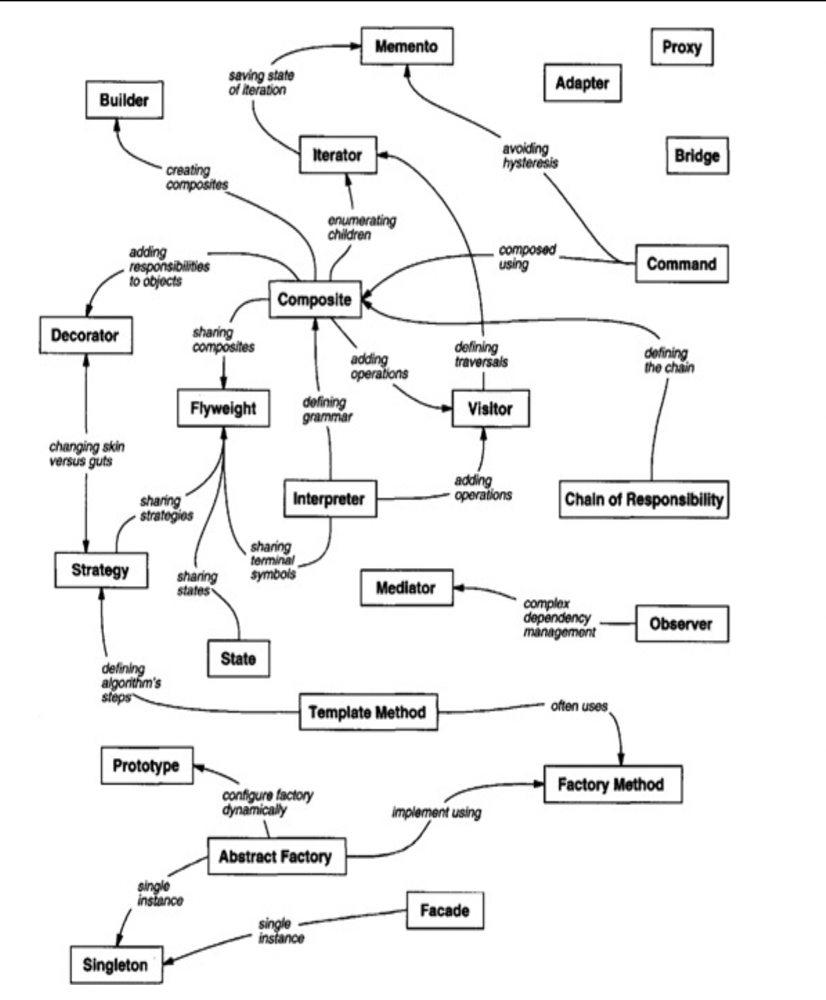

# 设计模式

这是一个由浅入深的过程, 教材参考

+ [Design Patterns_Elements of Reusable Object-Oriented Software ](Design%20Patterns_Elements%20of%20Reusable%20Object-Oriented%20Software%20.pdf)

+ [design patterns best practices in java](design-patterns-and-best-practices-in-java.pdf)

或者可以参考本书的中文版

+ [设计模式：可复用面向对象软件的基础](设计模式：可复用面向对象软件的基础.pdf)

+ [java 设计模式及实践](Java设计模式及实践.pdf)

之后参考进行深入学习

+ [Design Patterns Implement By Java](  https://java-design-patterns.com/patterns/)

# Code Practise
+ [Java - ongoing](Java)
+ [Go - ongoing](Go)
+ [Rust - ongoing](Rust)
+ [C - ongoing](C)
+ [React - ongoing](React)
+ [Node - ongoing](Nodejs)

# Brief

## Pattern Relation

## Design Pattern In MVC architect

The View-Controller relationship is an example of the Strategy (315) design
pattern. A Strategy is an object that represents an algorithm. It’s useful when you
want to replace the algorithm either statically or dynamically, when you have a
lot of variants of the algorithm, or when the algorithm has complex data
structures that you want to encapsulate.  
MVC uses other design patterns, such as Factory Method (107) to specify the
default controller class for a view and Decorator (175) to add scrolling to a view.
But the main relationships in MVC are given by the Observer, Composite, and
Strategy design patterns

# Cretional Patterns

## Abstract Factory

### Provide an interface for creating families of related or dependent objects without specifying their concrete classes.

## Factory Method

### Define an interface for creating an object, but let subclasses decide which class to instantiate. Factory Method lets a class defer instantiation to subclasses.

## Builder

### Separate the construction of a complex object from its representation so that the same construction process can create different
representations.

## Prototype

### Specify the kinds of objects to create using a prototypical instance, and create new objects by copying this prototype.

## Singleton

### Ensure a class only has one instance, and provide a global point of access to it.

# Structural Patterns

## Adapter

### Convert the interface of a class into another interface clients expect. Adapter lets classes work together that couldn’t otherwise because of incompatible interfaces.

## Bridge

### Decouple an abstraction from its implementation so that the two can vary independently.

## Composite

### Compose objects into tree structures to represent part-whole hierarchies. Composite lets clients treat individual objects and compositions of objects uniformly

## Decorator

### Attach additional responsibilities to an object dynamically. Decorators provide a flexible alternative to subclassing for extending functionality.

## Facade

### Provide a unified interface to a set of interfaces in a subsystem. Facade defines a higher-level interface that makes the subsystem easier to use.

## Flyweight

### Use sharing to support large numbers of fine-grained objects efficiently.

## Proxy

### Provide a surrogate or placeholder for another object to control

# Behavioral Patterns

## Chain of Reponsibility

### Avoid coupling the sender of a request to its receiver by giving more than one object a chance to handle the request. Chain the receiving objects and pass the request along the chain until an object handles it.

## Command

### Encapsulate a request as an object, thereby letting you parameterize clients with different requests, queue or log requests, and support undoable operations.

## Interpreter

### Given a language, define a represention for its grammar along with an interpreter that uses the representation to interpret sentences in the language.

## Iterator

### Given a language, define a represention for its grammar along with an interpreter that uses the representation to interpret sentences in the language.

## Mediator

### Define an object that encapsulates how a set of objects interact. Mediator promotes loose coupling by keeping objects from referring to each other explicitly, and it lets you vary their interaction independently

## Memento

### Without violating encapsulation, capture and externalize an object’s internal state so that the object can be restored to this state later.

## Observer

### Define a one-to-many dependency between objects so that when one object changes state, all its dependents are notified and updated automatically.

## State

### Allow an object to alter its behavior when its internal state changes. The object will appear to change its class.

## Strategy

### Define a family of algorithms, encapsulate each one, and make them interchangeable. Strategy lets the algorithm vary independently from clients that use it.

## Template Method

### Define the skeleton of an algorithm in an operation, deferring some steps to subclasses. Template Method lets subclasses redefine certain steps of an algorithm without changing the algorithm’s structure.

## Visitor

### Represent an operation to be performed on the elements of an object structure. Visitor lets you define a new operation without changing the classes of the elements on which it operates.

